# About the script

This script computes popular **classification accuracy metrics**. It was written to facilitate the comparison of results
across different scientific studies. Published raster-image classification results in the Earth sciences often come from
diverse methodologies and tools, which makes direct comparison difficult.

If you have any of the following data types:
- a post-classification image,
- raw classification pairs (`true`, `predicted`),
- a confusion matrix (cross matrix) or a per-class binary confusion matrix,

you can use this tool to compute a range of accuracy metrics.

---

# Usage
> **The `Usage help` section contains full help on how to use the script!**

After installation, run the script from any terminal by typing the command and providing the required positional
arguments. In the examples below, the argument is the name of a `csv` file with classification results
(see **Data Help**).

1. If the script was installed using the `pipx` manager, you can run it from anywhere without having to manually
   activate the virtual environment:
   ```bash
    -:$ accuracy raw_classification.csv
   ```

2. If you installed the script using the `pip` command, in a virtual environment, first activate the environment and
   then run the command:
   ```bash
    (acc) -:$ accuracy raw_classification.csv
   ```

3. There is also a simple GUI based on **Streamlit** that opens in your web browser.
   ```bash
    -:$ accuracy_gui
   ```
   **Note**:
    - *the GUI may not expose the full functionality of the CLI.*

---

# Installation

The script can be installed using the `whl` file::
  - download the latest version of the script from the `wheels` directory (`accuracy-3.0.1-py3-none-any.whl`),
  - or use the `RAW URL` address directly - see below.


## Installation with pip
It's best to install the script in a virtual environment. The following example assumes creating an environment for
installation.

   ```bash
      # 1. Create a virtual environment, e.g.:
      python -m venv acc
     
      # 2. Activate the virtual environment
      acc/Scripts/activate       # Windows System:
      source acc/bin/activate    # Linux (Debian):
     
      # 3. Install the package in the environment:
      #  - if the file was downloaded to disk:
      python -m pip install accuracy-3.0.1-py3-none-any.whl

      #  - or using RAW URL
      python -m pip install https://raw.githubusercontent.com/python-edu/accuracy_checker/main/wheels/accuracy-3.0.1-py3-none-any.whl
   ```

## Installation with pipx
Installing with the `pipx` manager automatically creates the appropriate virtual environment and updates environment
variables so that the script can be run from any location, without first activating the environment - see pipx
[documentation](https://pipx.pypa.io/latest/).

   ```bash
      # Install the package:
      #  - if the file was downloaded to disk:
      pipx install accuracy-3.0.1-py3-none-any.whl

      #  - or using RAW URL
      pipx install https://raw.githubusercontent.com/python-edu/accuracy_checker/main/wheels/accuracy-3.0.1-py3-none-any.whl
   ```

## Uninstallation
To uninstall the script, depending on your installation method, do the following:
  - for installation with `pip` - delete the environment directory with the installed script in any way:
    ```bash
      rm -rf acc/  # example for Linux
    ```

  - for installation with `pipx`:
    ```bash
      pipx uninstall accuracy
    ```
---


# Usage help
You can display help by calling the script with the following options:
  ```bash 
    -:$ accuracy -h/--help      # general help on how the script works
    -:$ accuracy usage help     # help about script usage
    -:$ accuracy data help      # information about input data
    -:$ accuracy metrics help   # information about accuracy metrics
    -:$ accuracy formula help   # help for custom calculation formulas
    -:$ accuracy example help   # displays a list of available input data files
  ```

## Input file schemes
You can input one (1) to three (3) files into the script, using one of the following schemes:
 - `scheme 1`: single **csv** file (see Using row data or Using cross matrices). In the GUI, this is option `File_1`.
 - `scheme 2`: single image file after classification if `_ref` file exists (see Using raster / vector). In the GUI, this is option `File_1`.
 - `Scheme 3`: two files, a **csv** file (`File_1` in the GUI) and a **json** file (`File_3` in the GUI).
 - `scheme 4`: two files, the image after classification (`File_1` in the GUI) and the reference data (image or vector - `File_2` in the GUI).
 - `scheme 5`: three files, the image after classification (`File_1` in the GUI), the reference data (`File_2` in the GUI), and the **json** file (class map, `File_3` in the GUI).

## Using example data
Sample data is available and copied to the user's directory each time the script is run. Running a script with sample
data requires entering the prefix **`example_data`** immediately after the script name, followed by the names of the
available files. 

### Raw cross marix with class_map:
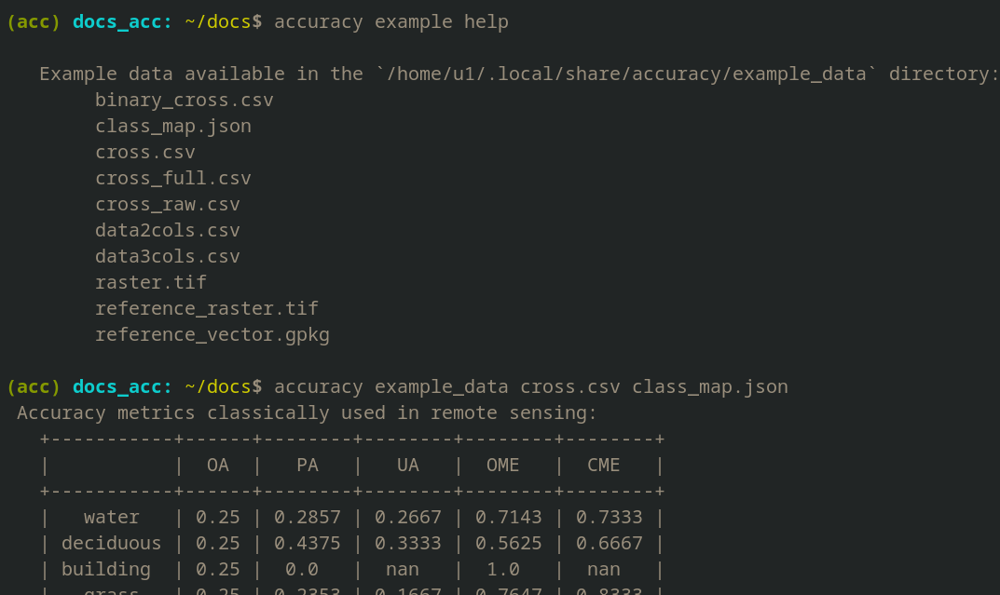

## Using *raw data*
The input is a single `*.csv` file:
 - raw data: data2cols.csv or data3cols.csv
 - confusion matrix: cross_raw.csv, cross.csv or cross_full.csv
 - binary_cross.csv

### data2cols.csv
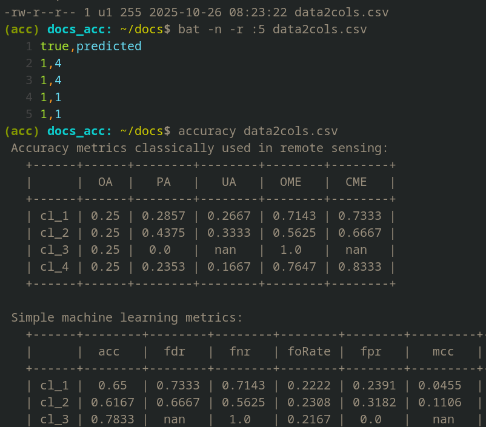

### data2cols.csv with class_map
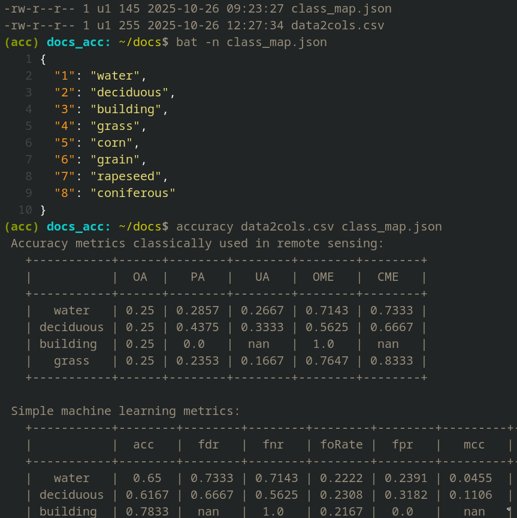

### data3cols.csv
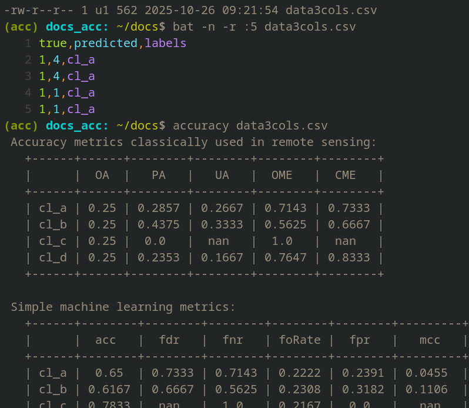

### data3cols.csv with class_map
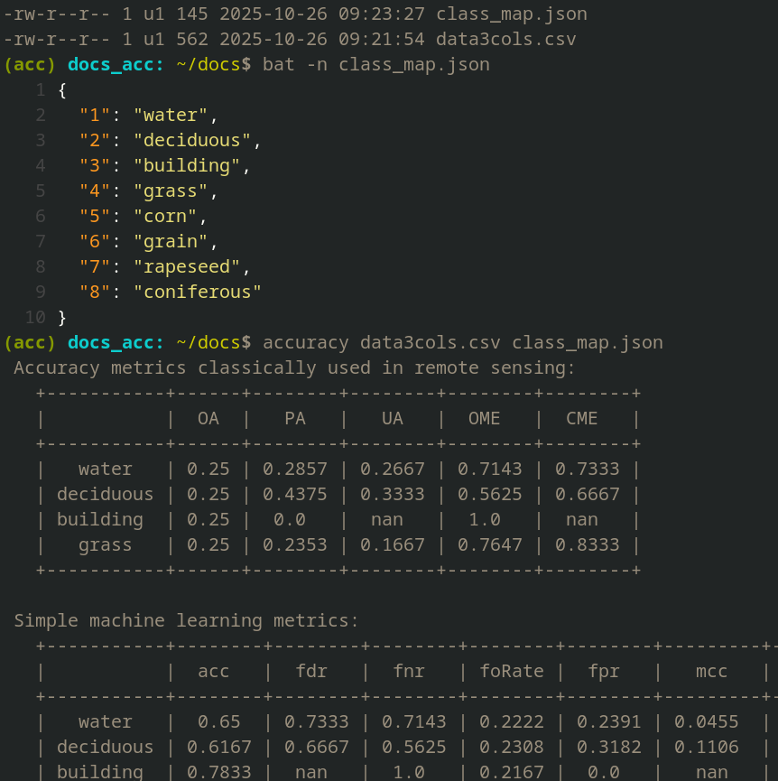


## Using *cross matrices*
### Raw cross marix:
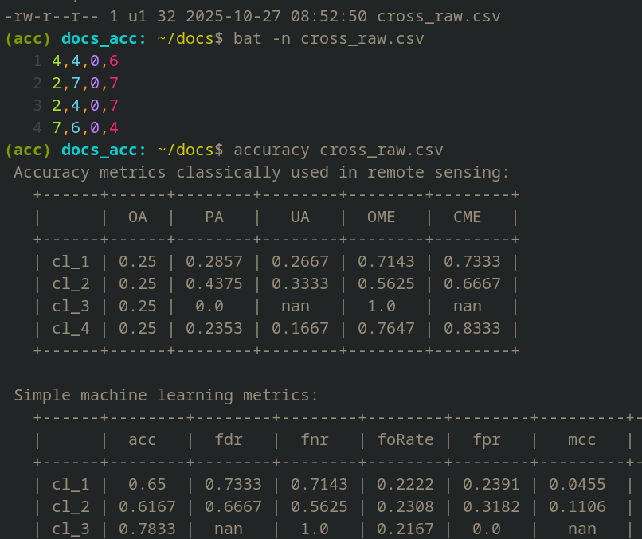

### Raw cross marix with class_map:
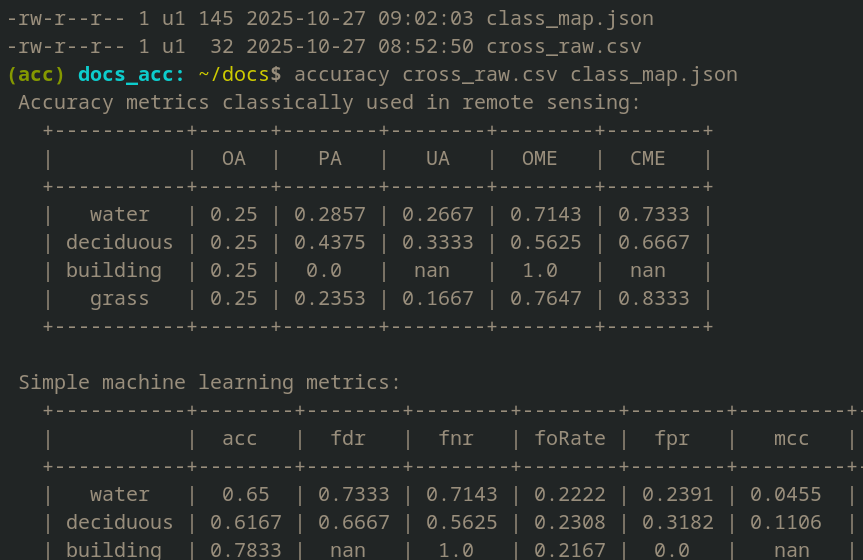

### Cross marix:
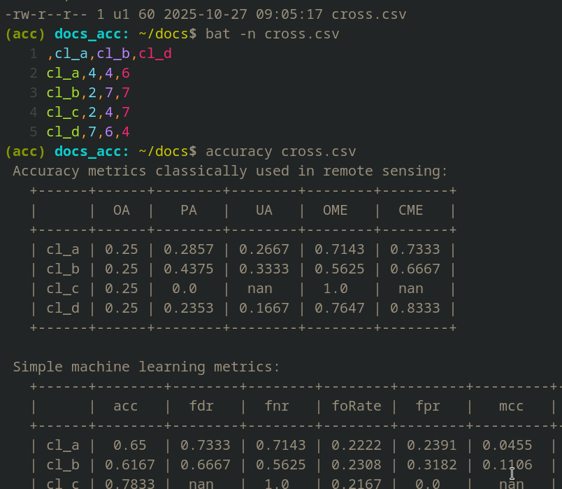

### Cross marix with class_map:
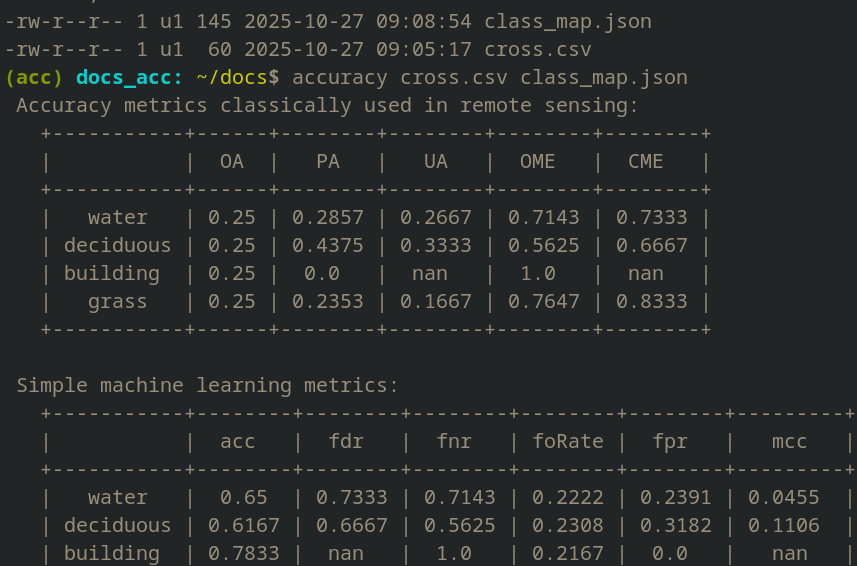

### Other cross matrix cases:
- using data in the form of `full cross matrix` and `binary cross matrix` is analogous to the cases shown above.


## Using *raster / vector*
The input is a raster or / and vector:
 - an image, after classification - typically `*.tif`
 - reference data (reference raster mask): image/mask `*.tif` or vector data e.g. `*.shp`, `*.gpkg`

### Input raster without data references
 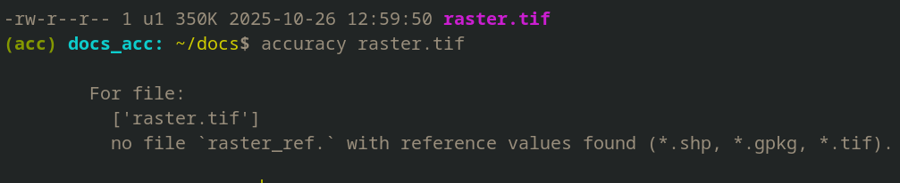

### Input raster with raster reference `_ref`
 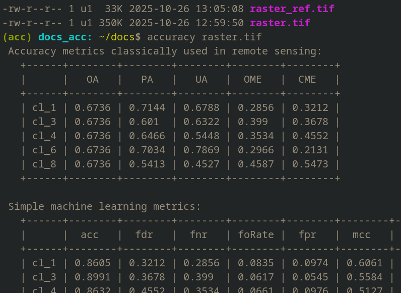

### Input raster with raster reference `_ref` + `*.json`
 

### Input raster with raster vector data reference
 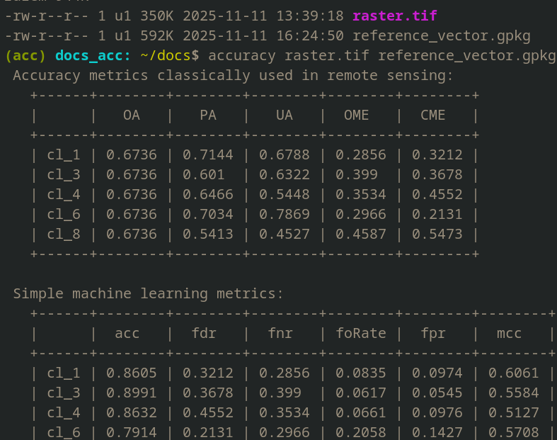


## Using *custom formula*
You can enter your own formula to estimate accuracy:
 ```bash
    -:$ accuracy file.csv -f "ac = (TP * TN - FP * FN) / ((TP + FP) * (TP + FN))**0.5"
 ```
---


# Data help

## Raw data:
Stores classification results in a `*.csv` table with 2 or 3 columns:

```bash
    # 2 columns:

    |    true   | predicted |
    |-----------+-----------|
    |    int    |    int    |
    |    ...    |    ...    |


    # 3 columns:

    |    true   | predicted |  lables  |
    |-----------+-----------+----------|
    |    int    |    int    |    str   |
    |    ...    |    ...    |    ...   |
```

 **Where**:
 - first column: true values (actual classes)
 - second column: predicted values (predicted classes)
 - third column: short names of classes e.g. water, wheat etc.

 **Input requirements**:
 - columns must be in order `[true_values, predicted]`
 - column names do not matter (eg. true, true_values, etc)


## Raw cross matrix
Confusion matrix for multi-class classification:
 - contains `only numbers`: no column / row descriptions (labels), no summaries (totals)
 - must be square: classes in columns must correspond to classes in rows, even if there are zeros in some class.

Default layout is:
 - rows: True classes (true labels).
 - columns: Predicted classes (predicted labels).

```bash
    |   21  |    5   |   7   | ...
    |    6  |   31   |   2   | ...
    |    0  |    1   |  22   | ...
    |  ...  |   ...  |  ...  | ...
```


## Cross (labeled cross matrix)
Confusion matrix for multi-class classification:
 - contains numbers and descriptions (labels) of columns and rows (class names), without summaries (totals)
 - does not have to be square.

Default layout is:
 - rows: True classes (true labels).
 - columns: Predicted classes (predicted labels).

```bash
    |            | water | forest | urban | ...
    |------------+-------+--------+-------+-----
    |   water    |   21  |    5   |   7   | ...
    |   forest   |    6  |   31   |   2   | ...
    |   urban    |    0  |    1   |  22   | ...
    |    ...     |  ...  |   ...  |  ...  | ...
```


## Full cross matrix
Full confusion matrix for multi-class classification:
 - contains numbers, column and row descriptions (class names) and row and column summaries
 - does not have to be square.

Default layout is:
 - rows: True classes (true labels).
 - columns: Predicted classes (predicted labels)

```bash
    |            | water | forest | urban | ... |  sums  |
    |------------+-------+--------+-------+-----|--------|
    |   water    |   21  |    5   |   7   | ... |   ...  |
    |   forest   |    6  |   31   |   2   | ... |   ...  |
    |   urban    |    0  |    1   |  22   | ... |   ...  |
    |    ...     |  ...  |   ...  |  ...  | ... |   ...  |
    |------------+-------+--------+-------+-----|--------|
    |    sums    |  ...  |   ...  |  ...  | ... |   ...  |
```


## Binary cross matrix
Per-class binary confusion values.

```bash
    |    | water | forest | ... |
    |----+-------+--------+-----|
    | TP |    1  |   55   | ... |
    | TN |   15  |   99   | ... |
    | FP |    5  |    3   | ... |
    | FN |   33  |   46   | ... |
```

 **where**:
 - columns: classes present in the dataset
 - rows: binary outcomes per class
 - TP (True Positives): the number of samples correctly classified as a given class
 - TN (True Negatives): the number of samples that do not belong to a given class and were correctly identified as not belonging.
 - FP (False Positives): the number of samples incorrectly classified as a given class
 - FN (False Negatives): the number of samples of a given class that were incorrectly classified as not belonging to that class


## Raster data
The input data can also be raster images and vector data:
 - two raster images: classification result and reference image (mask)
 - raster image and vector data

### Raster images:
  - should be in `*.tif` format, georeferenced
  - different file extensions are accepted: `'*.tif', '*.tiff', '*.TIF', '*.TIFF'`

### Vector data formats supported:
  - `*.shp` ESRI Shapefile spatial data format
  - `*.gpkg` the GeoPackage (GPKG)

> **Tip**:
>
> If the reference file shares the same name as the classification result raster with an `_ref` suffix, you can provide
> only the classification raster path and the script will find the reference automatically. For example, instead of:
> ```bash
>   -:$ ccuracy my_classification.tif my_classification_ref.tif
>   -:$ ccuracy my_classification.tif my_classification_ref.shp
> ```
> 
> You can:
> ```bash
>   -:$ ccuracy my_classification.tif
> ```


## `*.json` file
A JSON text file used to rename (relabel) classes. The file must map current class labels to new labels, for example:

  ```bash
    {
      "cl_a": "grass",
      "cl_b": "coniferous forest",
      "cl_c": "roads"
    }
  ```

If the input data do not include class names (for example, `cross_raw.csv`),
the mapped names will be applied based on the row and column indices (integers)
of the matrix.

---


# Metrics help

## Symbols

We use the standard binary symbols:
 - TP true positive
 - TN true negative
 - FP false positive
 - FN false negative.


## Remote sensing metrics
Accuracy metrics classically used in remote sensing:

 - OA (overall_accuracy):
   $$OA = \sum(TP) / (TP + TN + FP + FN)$$

 - PA (producer_accuracy):
   $$PA = TP / (TP + FN)$$

 - UA (user_accuracy):
   $$UA = TP / (TP + FP)$$

 - OME (omission errors / errors_of_omission):
   $$OME = FN / (TP + FN)$$

 - CME (errors_of_commision):
   $$CME = FP / (TP + FP)$$

 - NPV (negative predictive value):
   $$NPV = TN/(TN + FN) = 1 - FOR$$


## Modern accuracy
> Classification accuracy metrics found in contemporary scientific publications (*some overlap with those above*).

These metrics can be conventionally divided into simple metrics (calculated directly from the TP, TN, FP and FN values)
and complex metrics (calculated using simple metrics).

### Simple metrics

 - ACC (accuracy):
   $$ACC = (TP+TN) / (P+N) = (TP+TN) / (TP+TN+FP+FN)$$

 - PPV (precision or positive predictive value):
   $$PPV = TP / (TP + FP)$$

 - TPR (sensitivity, recall, hit rate, or true positive rate):
   $$TPR = TP / P = TP / (TP + FN) = 1 - FNR$$

 - TNR (specificity, selectivity or true negative rate):
   $$TNR = TN / N = TN / (TN + FP) = 1 - FPR$$

 - NPV (negative predictive value):
   $$NPV = TN / (TN + FN) = 1 - FOR$$

 - FNR (miss rate or false negative rate):
   $$FNR = FN / P = FN / (FN + TP) = 1 - TPR$$

 - FPR (fall-out or false positive rate):
   $$FPR = FP / N = FP / (FP + TN) = 1 - TNR$$

 - FDR (false discovery rate):
   $$FDR = FP / (FP + TP) = 1 - PPV $$

 - FOR (false omission rate):
   $$FOR = FN / (FN + TN) = 1 - NPV $$

 - TS / CSI (Threat score (TS) or critical success index (CSI)):
   $$TS = TP / (TP + FN + FP) $$

 - MCC (Matthews correlation coefficient):
   $$mcc = (TP \cdot TN - FP \cdot FN) / ((TP+FP) \cdot (TP+FN) \cdot (TN+FP) \cdot (TN+FN))^{0.5}$$


### Complex metrics

 - PT (Prevalence Threshold):
   $$pt = ((TPR \cdot (1 - TNR))^{0.5} + TNR - 1) / (TPR + TNR - 1)$$

 - BA (Balanced accuracy):
   $$ba = (TPR + TNR) / 2$$

 - F1 score (is the harmonic mean of precision and sensitivity):
   $$f1 = 2 \cdot (PPV \cdot TPR) / (PPV + TPR) =  2\cdot TP / (2 \cdot TP + FP + FN)$$

 - FM (Fowlkes–Mallows index):
   $$fm = ((TP/(TP+FP)) \cdot (TP/(TP+FN)))^{0.5} = (PPV \cdot TPR)^{0.5}$$

 - BM (Bookmaker informedness):
   $$bm = TPR + TNR - 1$$

 - MK (markedness or deltaP):
   $$mk = PPV + NPV - 1$$


# Formula help
You can define your own calculation formula:
 
  - The calculations use the binary_cross matrix table.
  - The formula must follow Python's arithmetic syntax.
  - Use the following labels: TP, TN, FP, and FN.
  - The formula should consist of a left-hand side and a right-hand side: `metric = mathematical operations`. Example:
    
    $$mcc=(TP*TN-FP*FN)/((TP+FP)*(TP+FN)*(TN+FP)*(TN+FN))**0.5$$

  - Do not use whitespace (e.g., spaces) in the formula or metric name.
  - The metric name should be a short string, such as OA, f1, etc.
  - The pattern entered into the script must be surrounded by quotation marks (single `'` or double `"`).
 
**Example of script use:**

  ```bash
     -:$ accuracy input_path -f "mcc=(TP*TN-FP*FN)/((TP+FP)*(TP+FN)*(TN+FP)*(TN+FN))**0.5"
     -:$ accuracy input_path --formula "mcc=(TP*TN-FP*FN)/((TP+FP)*(TP+FN)*(TN+FP)*(TN+FN))**0.5"
  ```


# Dependencies

 - [pytexit](https://pytexit.readthedocs.io/), tabulate, jinja2
 - numpy, pandas, geopandas
 - shapely, fiona, pyproj
 - rasterio, rtree
 - streamlit, streamlit-navigation-bar


# LICENSE
The project is licensed under the [MIT](./LICENSE) license.
For details, see the `LICENSE` file.
